# Proposta visual: o TecnoGame com cara de programa de auditório

> Inspiração: o **Show do Milhão**, do SBT, que estreou em 1999 com o nome
> de "Jogo do Milhão".
>
> **Veja jogando antes de ler.** [`prototipo-pergunta.html`](prototipo-pergunta.html)
> abre com dois cliques, no Chrome ou no Edge. Ligue o som.

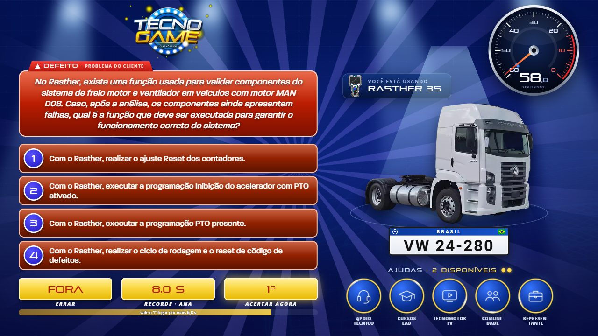

## Resumo: as cinco apostas

1. **A pergunta vira um programa, e não uma tela de aplicativo.** Hoje, a tela
   mais importante do jogo é uma janela de software, com barra de título e
   botões de minimizar e fechar. A proposta troca isso por um palco:
   - luz de estúdio;
   - a pergunta em destaque;
   - as alternativas no formato do gênero;
   - o scanner como um selo, "Você está usando".
2. **O jogo ganha um apresentador.** As frases "Posso perguntar?",
   "Valendo!", "Está certo disso?", "Certa resposta!", "Que pena!" e "Tempo
   esgotado!" aparecem grandes na tela, cada uma com seu som, e marcam as
   batidas do roteiro.
3. **O jogador vê o que está em jogo.** A faixa **ERRAR / RECORDE / ACERTAR**
   mostra, ao vivo, em que lugar do ranking a pessoa entra se acertar agora. E
   mostra também quantos segundos faltam para ela perder esse lugar.
4. **A revelação tem suspense de verdade.** A resposta trava, o estúdio apaga,
   um canhão de luz cai sobre a alternativa e se ouve um batimento. Só depois
   vem o veredito: no acerto, confete, aplauso e o ranking abrindo espaço para
   o jogador; no erro, a lição.
5. **O som é próprio e sintetizado.** A trilha acelera junto com o relógio, e
   toda a sonoplastia é gerada na hora, sem arquivo. De quebra, isso tira do
   totem as músicas de terceiros que ele toca hoje (ver §8).

## Como usar o protótipo

- **Abrir:** dê dois cliques em `prototipo-pergunta.html`. Não precisa de
  servidor, pelo mesmo motivo que o jogo não precisa: é um arquivo só, sem
  módulo ES e sem `fetch`, e usa as imagens e fontes de `../../web/assets`.
- **Dois estilos, na tecla `E`:**
  - **Clássico SBT:** a coluna do Show do Milhão de 2000, com os tons
    amostrados do próprio programa.
  - **Palco:** o terço inferior com losangos, que é a gramática do
    *Milionário*.
- **Atalhos:**

  | Tecla | O que faz |
  |---|---|
  | `1`–`4` | escolhe a alternativa |
  | `Enter` | confirma (e é o "PODE!") |
  | `Esc` | desiste da alternativa escolhida |
  | `R` | recomeça |
  | `F` | pula para a reta final |
  | `T` | deixa a partida quase sem tempo |
  | `M` | liga e desliga o som |

  A barra no canto de cima tem os mesmos comandos e mostra o **gabarito**,
  para dar para testar os três finais.
- **O que é de mentira:**
  - o ranking do painel (ANA 8,0 s, BRUNO 19,0 s…);
  - a pergunta é uma só, a do VW 24-280 do baralho de fábrica, com as dicas
    de verdade dela.
- **Menos movimento:** o protótipo respeita `prefers-reduced-motion`. O botão
  "Menos movimento" da barra simula essa opção: saem câmera, tremor, confete
  e varredura, e a cor continua dizendo o veredito.

## 1. O que o jogo já faz bem, e fica

A proposta constrói em cima disto; não recomeça do zero.

- **A roleta:** física de roda, lingueta, estalo em cada divisa, borrão
  angular e luz que não gira junto.
- **A saída do cadastro:** a "ficha lida e desmontada".
- **A revelação de 1,5 s**, a **reta final** com o tique subindo meio tom e a
  **lição** para quem erra.
- **A disciplina técnica:** palco fixo de 1920x1080, `file://` e som no relógio
  do áudio. O protótipo segue essas mesmas regras de propósito.

## 2. Diagnóstico: por que ainda parece aplicativo

| Momento | Hoje | O que falta para parecer jogo |
|---|---|---|
| Pergunta | Janela de scanner cinza, com minimizar/fechar, cartões cinza e cronômetro digital `00:58.27` | Palco, hierarquia, formato de gênero, luz |
| Confirmação | Modal azul genérico, "CONFIRMAR RESPOSTA?", por cima da lista | O "Está certo disso?", com a alternativa travando no lugar |
| Revelação | 1,5 s de cor, e troca de tela | Suspense antes e festa depois |
| Ajudas | Cinco botões retangulares que abrem um popup | Fichas de auditório, com a ajuda "entrando na linha" |
| Fim | Foto parada e ranking em texto | O jogador entrando no ranking na frente de todo mundo |
| Espera (45 s no cadastro) | Lista rolando devagar | Modo de atração de fliperama |
| Som | Colagem de faixas de terceiros | Identidade sonora própria |
| Transições | Uma só, o esmaecer | A mesma gramática, com assinatura |

| Hoje: a pergunta | Hoje: a confirmação | Hoje: o fim |
|---|---|---|
| 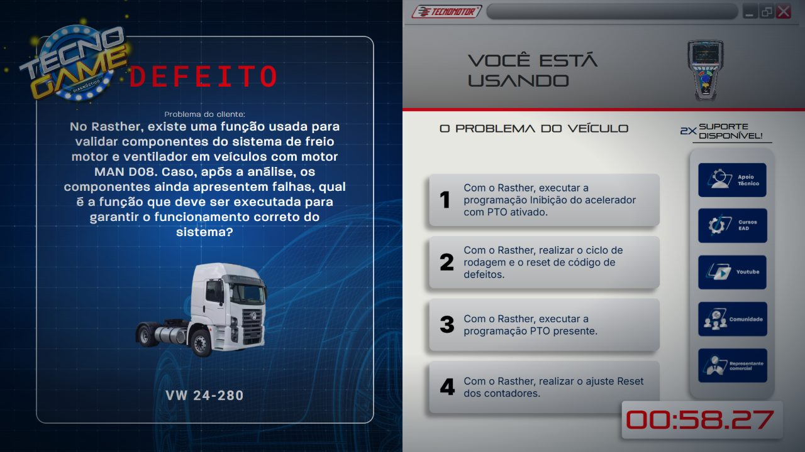 | 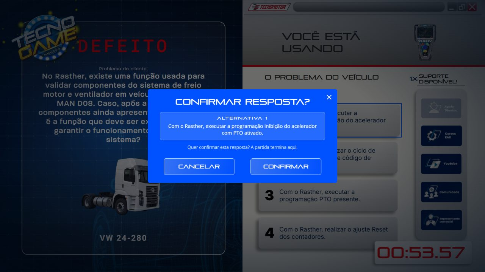 | 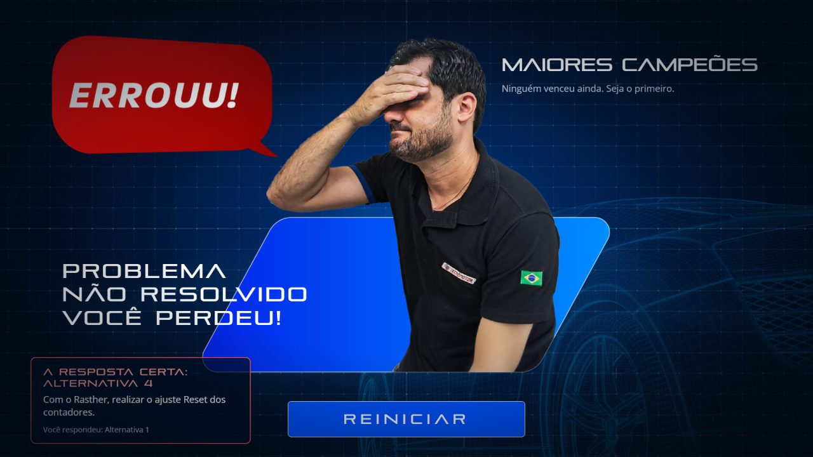 |

## 3. O que faz uma tela *ser* Show do Milhão

O Show do Milhão e o *Quem Quer Ser um Milionário?* se parecem, mas não são a
mesma coisa. **Os losangos ligados por uma linha são do Milionário**, e no
Brasil esse visual é da versão licenciada, a da Globo. O Show do Milhão era a
versão **não licenciada** do SBT, e tem um desenho próprio. Por isso o
protótipo tem os dois estilos, e o **Clássico** é o que responde ao pedido.

Assinaturas do Show do Milhão, em ordem de importância. A ordem e os tons vêm
de quadros dos programas de 2000, 2021 e 2024 (fontes em §10):

1. **A coluna.** À esquerda ficam logo, pergunta, as 4 alternativas empilhadas
   e a faixa de valores; a pessoa aparece à direita. O desenho é o mesmo de
   2000 a 2024.
2. **A faixa ERRAR / PARAR / ACERTAR:** três caixas amarelas com o valor em
   vermelho e o rótulo embaixo. No protótipo o PARAR vira **RECORDE**, porque
   aqui não se para.
3. **O número de 1 a 4 num círculo azul de aro branco.** A escolha **acende o
   número, de azul para vermelho**.
4. **A certa alterna entre a cor de antes e o verde**, num período de
   **≈0,4 s**, e assenta no verde.
5. **O logo em amarelo-ouro 3D.** O selo do TecnoGame já é dessa família.
6. **As ajudas próprias do programa:** Cartas (Rei, Ás, 2 e 3), Universitários,
   Placas e três Pulos.
7. **Os bordões:** "Posso perguntar?", "Está certo disso?", "Certa resposta!" e
   "Que pena, você errou".
8. **A paleta de 2000:**

   | Onde | Cor |
   |---|---|
   | Fundo | `#0C2FD3` → `#0E1671`, com raios roxos `#736ED8` |
   | Pergunta | `#BA1C01` |
   | Alternativa | `#912100` |
   | Círculo do número | `#372DDB` |
   | Valores | `#FAD742` |
   | Certa | `#007E42` |

   Os tons foram amostrados de vídeo comprimido, com margem de ±10%.
9. **A pergunta entra sozinha e as alternativas vêm depois.**
10. **Confete no prêmio máximo**, e barras de ouro.

Os jogos de PC (1999–2006) e de Mega Drive (2001) tinham **relógio de 40 s**
por pergunta. Quer dizer: pôr relógio num Show do Milhão tem precedente.

## 4. A proposta, momento a momento

### 4.1 A pergunta: o coração, e o que o protótipo mostra

| Clássico SBT | Palco |
|---|---|
|  | 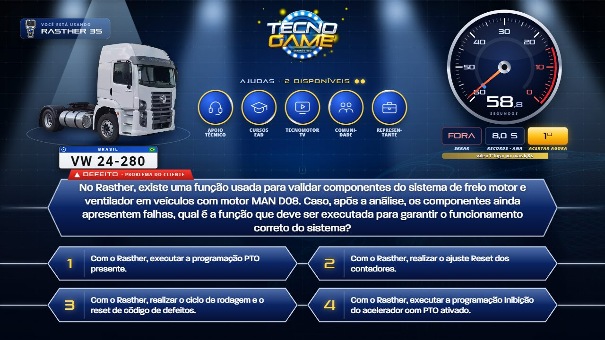 |

**Recomendo o Clássico como base, por três motivos:**

- é o que o público da feira reconhece de longe;
- o jogo já é dividido em esquerda e direita;
- o veículo ganha o "lugar do participante" no palco da direita.

O conta-giros, a luz, a faixa de aposta, as ajudas e a revelação valem igual
nos dois estilos. O que muda entre eles é só o arranjo e a paleta.

**O roteiro da pergunta**, na ordem em que o jogador vive:

1. **O painel liga.** O cenário entra, o conta-giros varre a escala inteira e
   volta, como painel de carro quando se dá a partida, e se ouve um ronco de
   motor sintetizado.
2. **"POSSO PERGUNTAR?"** O relógio só começa quando o jogador responde
   **PODE!**. Hoje ele começa enquanto as alternativas ainda estão entrando.
   Com isso, a partida fica justa para quem demorou a olhar a tela e ganha o
   ritual do programa.

   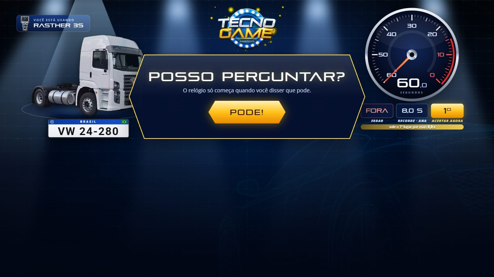
3. **A pergunta entra sozinha.** A caixa abre a partir de uma linha de luz, e
   uma luz corre pela borda.
4. **As alternativas chegam uma a uma**, a cada 230 ms, cada uma com um "ding"
   que sobe de nota.
5. **"VALENDO!"** vem com um impacto, e só aí o relógio começa.
6. **O relógio é um conta-giros.**
   - Vai de 60 a 0; o vermelho começa nos 15 s.
   - O ponteiro tem mola: ele tem massa e treme no vermelho.
   - O arco muda de azul para âmbar e depois para vermelho.
   - No zero, o motor "estoura": o ponteiro bate no fim, sai fumaça e soa um
     alarme.
7. **A faixa ERRAR / RECORDE / ACERTAR AGORA.** A posição que o jogador pegaria
   se acertasse agora cai enquanto o tempo anda. Uma barra mostra "vale o 2º
   lugar por mais 3,2 s". É o "meaning" do Nijman: haver algo em jogo.
8. **A reta final, nos últimos 15 s.**
   - A luz do estúdio fica vermelha e a vinheta fecha.
   - A trilha sobe de andamento: 96, depois 112, depois 132 bpm.
   - Nos últimos 10 s, cada segundo tem um tique e um pulso vermelho na tela.
   - Nos últimos 3 s, entra também um grave.

   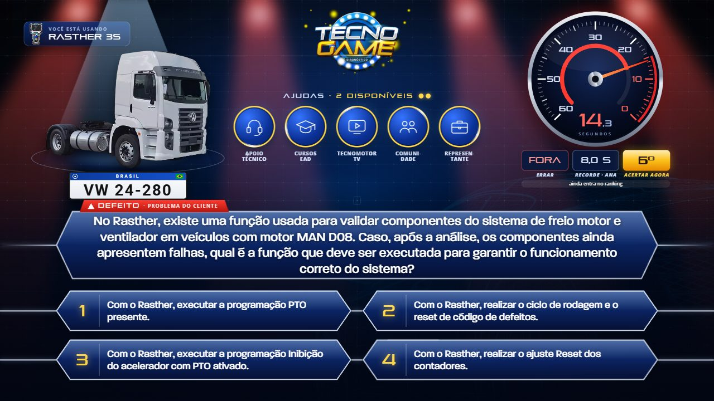
9. **As ajudas são fichas de auditório.** Ao usar uma, a ficha vira e mostra um
   X, e o cartão da ajuda nasce de dentro dela como uma conversa:
   - "Chamando o Apoio Técnico…" com o tom de chamada de 425 Hz;
   - a foto do time;
   - "digitando…";
   - e a dica, digitada.

   São as mesmas cinco ajudas de hoje, com as fotos e os textos do baralho.

   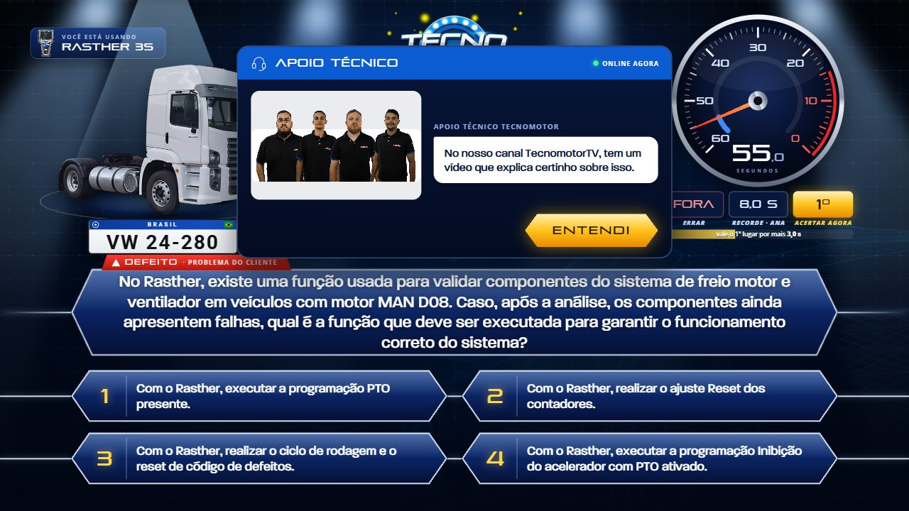
10. **"ESTÁ CERTO DISSO?"** A alternativa **trava no lugar**: fica dourada no
    Palco; no Clássico, o número fica vermelho. O painel repete o texto da
    escolhida, com os botões **SIM, É ESSA!** e **NÃO**. O relógio continua
    correndo, e esse é o aperto.

    | Clássico | Palco |
    |---|---|
    | 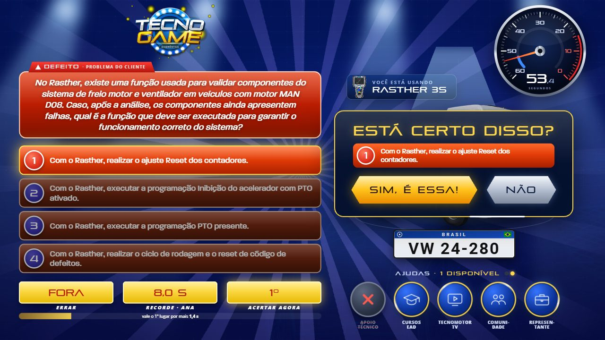 | 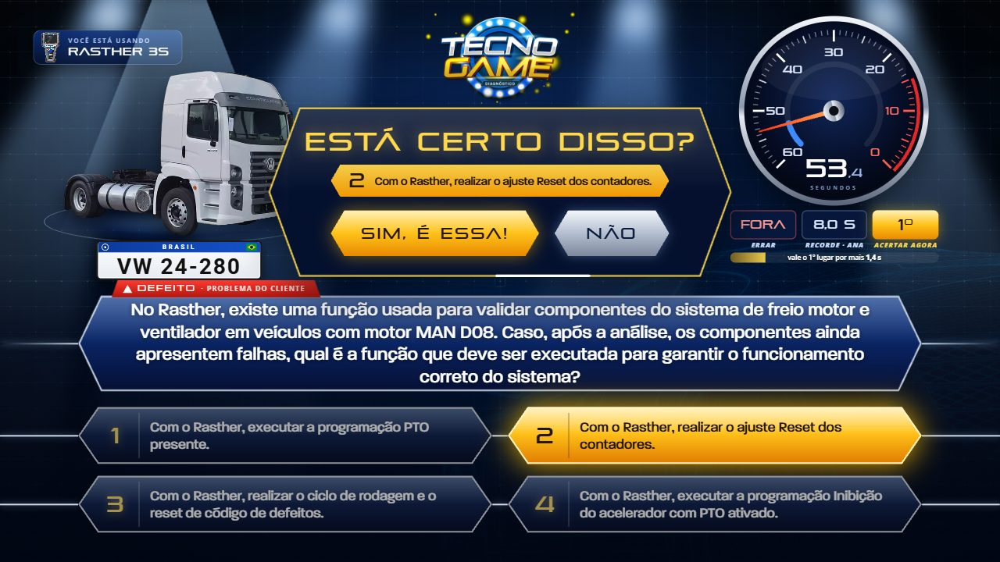 |
11. **O suspense.**
    - O relógio para com um *clunk*.
    - O estúdio apaga, e sobra um canhão de luz na alternativa.
    - A câmera se aproxima 6%.
    - Um zumbido grave e um batimento que acelera tocam por 2,6 s.
    - Vêm **150 ms de silêncio**, o "sleep" do Nijman: é ele que faz a pancada
      seguinte parecer alta.

    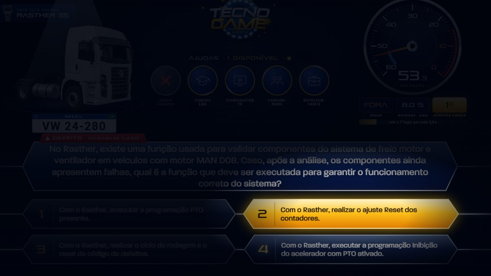
12. **O veredito**, que tem três finais:

    - **Acerto:**
      - flash branco, e a certa alterna travada ↔ verde três vezes;
      - a luz vira ouro, com raios e canhões de confete;
      - toca uma fanfarra de metais sintetizados com um **aplauso granular**,
        feito de centenas de palmas de ruído;
      - aparece "CERTA RESPOSTA!";
      - o tempo sobe num **odômetro**;
      - **o ranking abre espaço**: quem está atrás desce uma linha e troca de
        número, o 5º cai fora, e o jogador entra voando na vaga.

      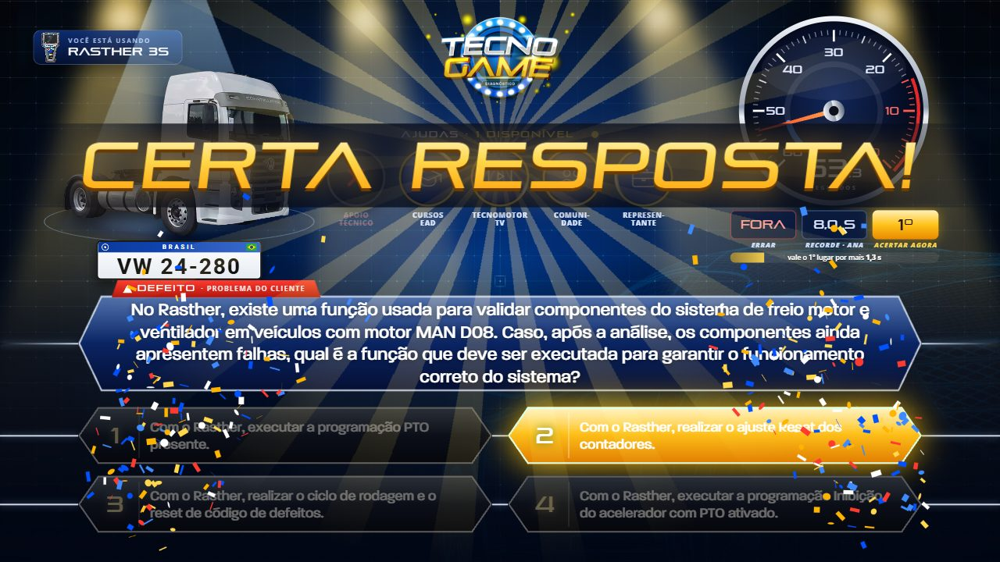

      | Clássico | Palco |
      |---|---|
      | 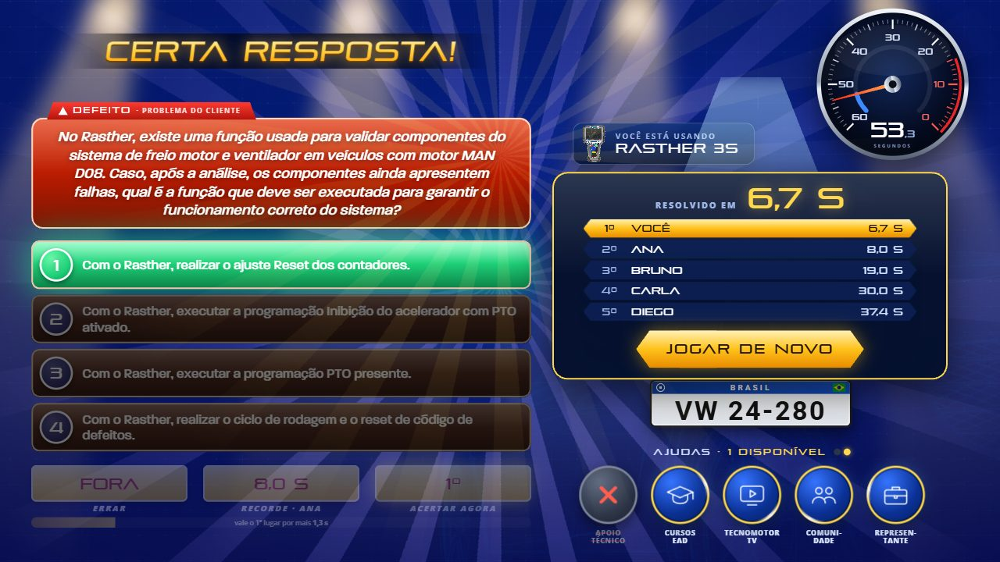 | 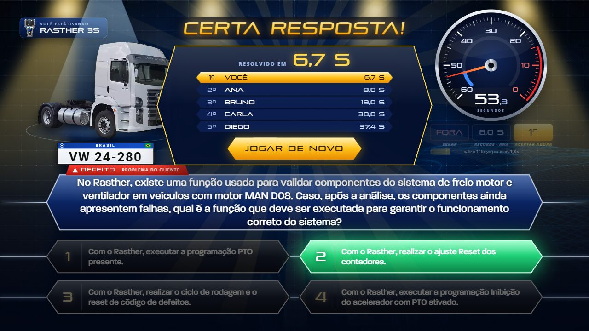 |
    - **Erro:**
      - um flash vermelho e um tremor curto;
      - a alternativa tem um "glitch" de sinal, como erro de diagnóstico;
      - a certa pisca do escuro para o verde;
      - aparece "QUE PENA!", e em seguida o **cartão da lição**, com a
        resposta certa e a dica do TecnomotorTV daquela pergunta.

      O som é **sem deboche**: três notas que descem e um baque. Quem joga é
      cliente, e não motivo de piada.

      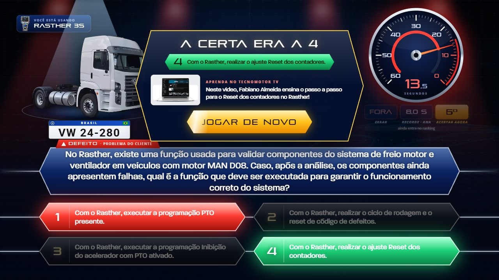
    - **Tempo esgotado:** o conta-giros estoura, com fumaça, faíscas e
      alarme, e aparece "TEMPO ESGOTADO!". Depois vêm a certa e a lição.

      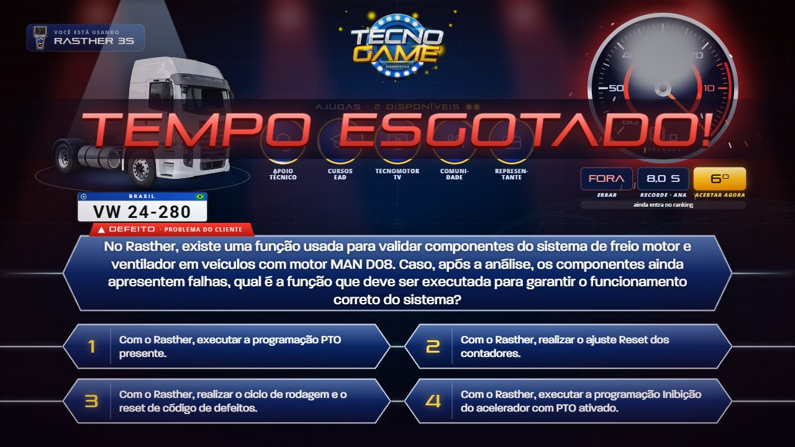

### 4.2 A transição única, agora com assinatura: a lâmina de luz

O jogo decidiu ter **uma gramática só** de troca de tela (ver `router.js`), e
está certo. A proposta mantém a regra e troca só o gesto.

- **O gesto novo:** no lugar do esmaecer, uma **faixa de luz inclinada**
  atravessa o palco. O que fica para trás dela já é a tela nova, e passa um
  *whoosh*. É a entrada do protótipo.
- **Menos movimento:** quem pediu menos movimento continua vendo o esmaecer.

### 4.3 Atração: quando ninguém está jogando

Não está no protótipo.

**Para que serve:** um totem de feira vive de atrair quem passa. Os
fliperamas resolviam isso com um **modo de atração**: título, recordes,
demonstração e "insert coin".

**Hoje:** depois de 45 s parado, o cadastro mostra uma lista rolando devagar.

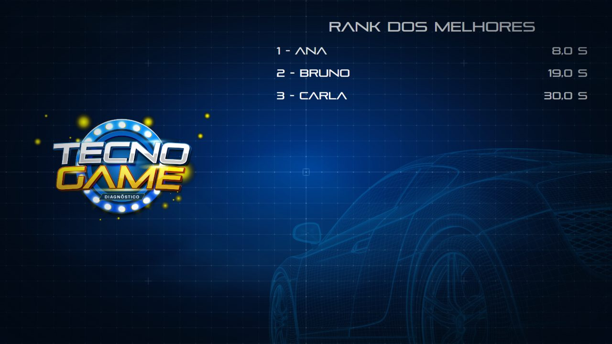

**A proposta** é trocar a lista por um laço de 20–30 s. [SUPOSIÇÃO: a duração
é a minha estimativa; afinar vendo o estande.] O laço teria:

- o **selo com as lâmpadas correndo como letreiro de auditório**. As doze
  lâmpadas já foram medidas no `Selo_2.png` e estão na abertura do protótipo;
- **"TOQUE PARA JOGAR"** pulsando, com os refletores varrendo;
- o **Hall da fama de hoje**: pódio animado dos 5 mais rápidos e "O mais rápido
  de hoje: ANA, 8,0 s";
- **números do dia**, como "137 jogadores · 42% acertaram", tirados das
  partidas locais;
- a **roleta girando sozinha, devagar**, mostrando os veículos em jogo.

**O prazo de 4 minutos continua valendo:** o modo de atração é o que o
cadastro mostra enquanto espera, e não uma tela nova.

### 4.4 Cadastro

- **O selo com as lâmpadas correndo**, no lugar da imagem parada.
- **"COM VOCÊS: DAVI!"** Ao confirmar a ficha, o apresentador anuncia o
  participante pelo primeiro nome, com aplauso, antes do vídeo de instruções.
  Isso custa 1,5 s e personaliza a partida inteira.
- **Os botões de confirmar ganham o brilho passando** e o afundar no toque.

### 4.5 Roleta: já é boa, e falta a festa do "parou!"

- **A fatia que ganhou acende.** A seta é fixa, então a fatia vencedora
  sempre para no mesmo lugar, e o destaque é uma forma estática desenhada
  sob a seta.
  - As lâmpadas do aro piscam juntas.
  - Toca um "ding-ding-ding", junto com o nome do carro.
  - Sai uma pequena rajada de faíscas.
- **Girar com o dedo (comando).** O jogador arrasta a roda e solta, e a força
  do gesto escolhe **quantas voltas inteiras a mais** a roda dá (de 3 a 6) e
  quanto tempo o giro dura.
  - A **regra 4 do CLAUDE.md continua de pé**: as voltas extras são inteiras,
    e a fatia sob a seta continua sendo a de `escolhaParaIndice()`.
  - O `verify/baralho.mjs` continua valendo, sem mudança.
- **Botão físico:** "APERTE O BOTÃO!" (ver §4.10).

### 4.6 Carro sorteado

- **Revelação de showroom:** quando o carro para, um reflexo de luz atravessa
  a lataria, e há um flash de câmera.
- **A placa Mercosul com o nome do veículo** entra como um carimbo. Ela já está
  no protótipo, e é um detalhe que o mecânico reconhece na hora.

### 4.7 Escolha do equipamento

- **Os cartões inclinam em 3D** na direção do dedo.
- **O escolhido voa para o centro e "liga"** (a tela dele acende) antes do
  vídeo.
- **O incompatível leva o carimbo "INCOMPATÍVEL"** e um *buzz*, no lugar do
  popup de hoje.

### 4.8 Fim

**A festa muda de lugar.** A celebração passa para a própria tela da
pergunta, na revelação e no ranking. Com isso, a tela de fim vira **pódio e
chamada para o estande**:

- o ranking do dia, com a posição do jogador;
- a foto do anfitrião da Tecnomotor que já existe, com um balão curto;
- a chamada "Fale com um representante".

> **Na revisão da 3.0 (2026-09-28)** a chamada saiu: a tela de fim ficou com
> o pódio, a lição (para quem errou) e o REINICIAR.

**Para quem errou:**

- a lição continua ali;
- **proposta:** um **QR code** para o vídeo do TecnomotorTV daquela pergunta.
  O QR precisa de um gerador em JS puro, ou de um código pré-gerado no painel,
  e de o baralho guardar o link de cada pergunta. Hoje o campo
  `ajudaTecnomotorTv` é só texto.

### 4.9 Ajudas: o que o Show do Milhão tem e o jogo pode ganhar

As duas ideias abaixo são decisões do time: mudam regra ou dado.

- **Cartas**, a ajuda mais icônica do programa.
  - O jogador vira uma de quatro cartas. O Rei não elimina nada; o Ás, o 2 e
    o 3 eliminam uma, duas ou três erradas.
  - As alternativas eliminadas se apagam em cena, e isso é drama puro.
  - Entraria como ajuda especial, e **muda a regra das 2 ajudas**.
- **Placas com dado de verdade:** a porcentagem dos jogadores anteriores que
  escolheram cada alternativa *daquela* pergunta.
  - **Exige gravar** o id da pergunta e a alternativa escolhida na partida.
    Hoje `createUsuariosRecordData` não guarda nenhum dos dois. É contrato
    novo em `usuarios`, nas regras do Firestore e na aba Respostas (CSV).
  - Rende de brinde o dado que o time de treinamento quer: **qual resposta
    errada é a mais comum**.

### 4.10 Comandos

- **Toque:**
  - alvos grandes, entre 94 e 110 px de altura no palco;
  - o afundar no toque usa a propriedade `scale`, como o jogo já faz, para
    não disputar `transform`;
  - o toque em cima de alternativa ou ficha já usada não faz nada.
- **Teclado:** `1`–`4`, `Enter`, `Esc` e `Espaço` já funcionam no protótipo. É
  o que permite **botões físicos**.
- **Botão de fliperama USB.** Um kit "encoder zero delay" com botões grandes
  vira teclado para o computador: um botão vermelho no pedestal para "GIRAR"
  e "PODE!", ou quatro botões coloridos para as alternativas. É o WOW mais
  barato do estande.
  - [SUPOSIÇÃO: preço na faixa de R$ 100–250 no varejo nacional; cotar.]
  - A Gamepad API é a alternativa para controle de videogame.
- **Operador:** um atalho escondido para som, volume e voltar ao cadastro.
  Hoje o volume é fixo no código. Uma feira barulhenta e um auditório
  silencioso pedem volumes diferentes, e o painel de administração pode ter
  um controle.

### 4.11 Som: identidade própria, e sem arquivo

O protótipo prova que dá para fazer toda a sonoplastia **sintetizada na Web
Audio**. Por `file://` ela é a única opção, pelo mesmo motivo do `estalo.js`.

- **O que ela cobre:**

  | Tipo | Sons |
  |---|---|
  | Trilha | trilha de suspense em 3 níveis |
  | Sinais | ding das alternativas; travar; *clunk* do relógio; batimento; tique; alarme |
  | Momentos | fanfarra de metais; aplauso granular; a derrota "sem deboche"; ronco de motor; estouro |
- **Na mixagem:**
  - um **limitador** no fim da linha (`DynamicsCompressor`), para
    fanfarra, aplauso e grave somados não estourarem a caixa do estande;
  - uma "sala" por convolução, com impulso gerado na hora.
- **O relógio:**
  - tudo é marcado **no relógio do áudio**, com antecedência;
  - na implementação, usar a ponte medida de `criarEstalos`.
- **Moderação.** Pesquisas sobre "juice" acharam que o exagero piora a
  experiência:
  - com juice nenhum ou extremo, tempo de jogo, motivação e desempenho
    caíram (Kao, 2020);
  - som de vitória aumenta a excitação e faz superestimar as vitórias
    (Dixon et al., 2014).

  A regra é de juice médio a alto.

## 5. Linguagem visual

| | Clássico SBT | Palco |
|---|---|---|
| Pergunta | Caixa vermelha `#BA1C01`, cantos de 22 px, texto em itálico | Losango azul, borda prata, linha atravessando a tela |
| Alternativas | Barra `#912100` e número no círculo azul `#372DDB` com aro branco | Losango azul e número em ouro |
| Travada | Número vermelho, barra laranja e contorno amarelo | Barra ouro e texto escuro |
| Certa | Alterna travada ↔ verde (0,4 s) e assenta no verde `#007E42` | Idem |
| Valores | Caixas amarelas `#FAD742` com valor vermelho | Caixas escuras, e ACERTAR em ouro |
| Fundo | Azul royal com raios roxos girando devagar | O fundo de hoje, mais escuro, com refletores |

**Tipografia:** as famílias são as que o jogo já carrega.

- **pirulen** para títulos e números;
- **Paralucent** para o texto de pergunta e alternativas;
- **Open Sans** para rótulos.

**Tempos que governam a sensação.** Cada número vem com o motivo, como o
CLAUDE.md pede:

| O quê | Quanto | Por quê |
|---|---|---|
| Entrada de cada alternativa | 400 ms, uma a cada 230 ms | O olho lê na ordem em que vai precisar; mais rápido que isso, chegam "juntas" |
| Suspense antes do veredito | 2,6 s + 150 ms de silêncio | Longo o bastante para o batimento acelerar 5 vezes; mais, e a fila da feira sente |
| Alternância da certa | período de 0,4 s, 3 vezes | Medido no programa; 2,5 piscadas/s, abaixo do limite de 3/s do WCAG para fotossensibilidade |
| Flash do veredito | 380 ms, pico a 12% | Pancada e não luz acesa; com menos movimento, cai para 35% da intensidade |
| Tremor do erro | 480 ms, ±18 px, amplitude caindo | Um "não" do corpo inteiro que morre sozinho; mais longo vira castigo |
| Aproximação da câmera | 6% em 2,6 s | Percebe-se sem se notar |

## 6. Como isso cabe no código

**Módulos novos.** Cada um tem uma responsabilidade, como o jogo já é
organizado.

| Módulo | Faz |
|---|---|
| `web/js/palco.js` | A "mesa de luz": humores (normal, reta, suspense, acerto, erro) na camada `#fundo`, que já existe e já persiste entre as telas. Cor por `@property`, para transitar. |
| `web/js/som.js` (ou `audio.js`) | As vozes sintetizadas e a trilha agendada |
| `web/js/particulas.js` | Um `<canvas>` em `#overlays`, que dorme quando não há partícula |
| `web/js/locutor.js` | Os gritos e os painéis do apresentador |
| `components/tacometro.js` e `components/aposta.js` | O relógio e a faixa de valores |

**O que muda.**

- A mudança grande: `perguntas_erespostas.js` e `tela_acao.js`.
- `confirmacao.js` vira o "Está certo disso?", com a alternativa travando no
  lugar.
- `router.js` ganha a lâmina.
- `fim.js` passa a ser pódio (a chamada para o estande saiu na revisão; ver
  §4.8).
- `ranking.js` vira o modo de atração.

**O roteiro da pergunta como máquina de estados:**

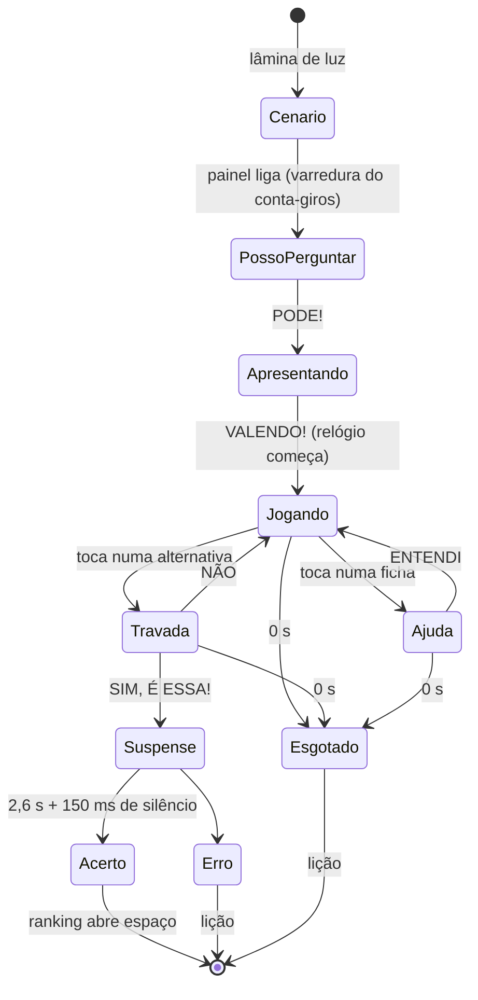

**As armadilhas do CLAUDE.md que esta proposta pisa, e como o protótipo
desviou:**

- **Animação ganha de CSS.** Os estados da alternativa usam propriedades que
  nenhuma animação disputa: `filter` para esfriar, `scale` para o toque e
  camadas de SVG próprias para a cor. O verde mora num `<path>` só dele, por
  cima da cor de travada. É isso que deixa a certa alternar sem trocar `fill`,
  que não se anima.
- **`applyInitialState` nunca apaga o quadro 0.** No protótipo, toda entrada é
  `fill: backwards`: o quadro 0 vale só durante o atraso e, ao terminar, o
  elemento volta ao CSS. No porte para `anim.js`, manter a mesma ideia.
- **`.ff-stack` recorta.** Os brilhos do veredito (`drop-shadow` de 30 px)
  pedem `overflow: visible` no invólucro da alternativa, como `[data-resposta]`
  já tem.
- **O Firestore fica pendente sem rede.** A faixa ACERTAR AGORA precisa do
  ranking **no começo da pergunta**. A proposta é pré-buscar enquanto o
  jogador gira a roleta, com `comPrazo`, e cair no ranking local. Se nada
  chegar, a faixa mostra só o recorde local.
- **Som que acompanha movimento sai do relógio do áudio.** Os tiques da reta
  final são marcados na divisa exata do segundo, com antecedência, e não no
  quadro que a mostra.

**Lições que o próprio protótipo deixou.** Cada uma virou um comentário no
lugar em que aconteceu.

- **`<text>` de SVG com `scale` animado.** O Chrome pintou o texto na escala
  do primeiro quadro, 1,25x maior e deslocado, embora o layout estivesse
  certo. A entrada do conta-giros ficou só em opacidade. O jogo atual não tem
  `<text>` em SVG; conferido.
- **`steps()` vai em cada quadro-chave**, e não nas opções da animação. Nas
  opções, a piscada vira uma troca só no fim.
- **`overflow: clip` no palco, e não `hidden`.** Com `hidden`, o palco continua
  rolável por programa, e os refletores e a lâmina passam da borda de
  propósito: o palco inteiro subia 200 px.
  - O palco atual não rola, porque nada passa da borda; conferido em seis
    telas.
  - Vale trocar junto com a entrada dos refletores.

**Testes.** O CLAUDE.md pede isto, e a proposta segue:

- probes novos no `verify`:
  - a alternância da certa, medida no tempo, como fiz para validar o
    protótipo;
  - a conta de posição e folga da faixa;
  - o ângulo do conta-giros;
- testes de unidade para `posicao` e a folga, junto de `posicaoNoRanking` em
  `functions.js`;
- **olhar a tela**, com capturas nos dois transportes.

**Desempenho no totem.** Refletores com `blur` e `mix-blend-mode`, mais o
canvas do confete, pedem GPU.

- [SUPOSIÇÃO: não sei a máquina do totem.] Medir o FPS nela.
- Ter um "modo leve" em `config.js`: sem desfoque nos refletores e sem
  confete.

**Versão.** Cada fase abaixo é uma atualização grande. Sobem juntos
`VERSAO_DO_JOGO`, o `package.json` e um item em `NOTAS_DE_ATUALIZACAO`.

## 7. Roteiro sugerido

As estimativas são **[SUPOSIÇÃO]** minhas, contando que o protótipo é
reaproveitado e que cada fase fecha com `npm run verify` 28/28 e capturas
revisadas.

| Fase | O que entra | Estimativa |
|---|---|---|
| **1. Som e palco** | Kit de som sintetizado, trocando as faixas de terceiros; `palco.js` com os refletores e os humores; a lâmina no roteador; o selo com as lâmpadas | 3–5 dias |
| **2. A pergunta nova** | Layout no estilo escolhido; conta-giros; faixa ERRAR / RECORDE / ACERTAR, com o ranking pré-buscado; "Posso perguntar?" e "Valendo!"; "Está certo disso?" no lugar; suspense e os três finais; fichas e cartões de ajuda | 8–12 dias |
| **3. Atração, fim e comandos** | Modo de atração; fim como pódio e chamada; festa do "parou!" na roleta; showroom do carro; equipamento em 3D; botão físico | 5–8 dias |
| **4. Dados que viram jogo** | Placas com porcentagem real; Cartas; QR para o vídeo; "Pergunta do Milhão do dia" (o operador dispara uma pergunta extra, valendo brinde, para o mais rápido do dia) | 4–6 dias, mais regras do Firestore e a aba Respostas |

## 8. Decisões para o time, antes de implementar

1. **O estilo.** A recomendação é o Clássico, e o Palco fica como alternativa.
   A paleta também pode ser discutida: o vermelho e amarelo de 2000 conversam
   com o vermelho da Tecnomotor, e o azul e ouro conversam com o selo
   TecnoGame.
2. **A pele de scanner.** O painel da direita de hoje imita o software do
   scanner, e isso é vitrine de produto. A proposta troca pela etiqueta "Você
   está usando" com a foto do equipamento. **Confirmar com o marketing.**
3. **"Posso perguntar?"** acrescenta um toque por partida. Recomendo, pela
   justiça e pelo ritual.
4. **As faixas de terceiros.** O jogo toca:
   - o tema do Jaspion (vídeo de transição);
   - a fanfarra de vitória de Final Fantasy (vitória);
   - a derrota de Brawl Stars (derrota);
   - o "select" do Undertale (seleções);
   - a faixa de Eric Skiff (pergunta).

   [SUPOSIÇÃO: não sei se há licença de alguma delas; perguntar a quem as
   escolheu.] Música em evento público costuma envolver direitos de execução
   pública, o ECAD. Isso é uma suposição minha, e não parecer jurídico:
   consultar o jurídico. A faixa de Eric Skiff indica "NO COPYRIGHT" no nome;
   o álbum dela costuma ser distribuído em Creative Commons **com atribuição**
   [SUPOSIÇÃO: conferir a licença no site do autor e creditar]. **A
   recomendação é trocar tudo pelo som sintetizado**, que resolve a licença e a
   identidade de uma vez.
5. **O que é referência e o que seria cópia.** O layout, as cores, os bordões e
   a mecânica são linguagem do gênero. **Não** usar:
   - o logotipo do Show do Milhão;
   - a trilha do programa;
   - a voz ou a imagem do Silvio Santos.

   [SUPOSIÇÃO: é leitura de bom senso, e não parecer jurídico.]
6. **Cartas e Placas mudam regra e dado** (§4.9).
7. **O hardware do totem.** Medir antes da Fase 2.

## 9. O protótipo, tecnicamente

- **Um arquivo só**, `prototipo-pergunta.html`, com cerca de 2 700 linhas:
  - sem dependências;
  - sem build;
  - não entra no bundle;
  - não toca em nada de `web/`.
- **Vozes sintetizadas:**

  | Grupo | Vozes |
  |---|---|
  | Sinais | sino, bumbo, prato, whoosh, impacto, tique, clunk, travar, pop, blip |
  | Ajudas | brilho, mensagem, digitar, chamada 425 Hz |
  | Momentos | metais, fanfarra, aplauso granular, derrota, alarme, estouro, ronco, rolagem de odômetro, suspense |

  Mais uma trilha de 3 níveis agendada com antecedência de 150 ms.
- **Recomeçar no meio de qualquer passo é seguro:** cada partida é uma
  "sessão", e toda espera de uma sessão velha acorda num erro que ninguém
  trata.
- **Testei com o Puppeteer do projeto os três finais nos dois estilos e, também
  nos dois estilos, estes casos-limite:**
  - recomeçar no meio da apresentação;
  - cancelar o "Está certo disso?";
  - o tempo acabando com o painel aberto;
  - ajuda aberta bloqueando resposta;
  - o modo "menos movimento";
  - a alternância da certa amostrada a cada 100 ms.

  Nenhum erro de página.
- **As capturas desta página** saíram do próprio protótipo, a 1280×720. As do
  "antes" vieram da suíte (`shots/http/…`).

## 10. Referências

A pesquisa foi feita para esta proposta. Os tons e tempos vêm de quadros de
vídeo, abertos nos instantes indicados.

- **Show do Milhão:**
  - verbetes [pt.wikipedia](https://pt.wikipedia.org/wiki/Show_do_Milh%C3%A3o),
    [en.wikipedia](https://en.wikipedia.org/wiki/Show_do_Milh%C3%A3o) e
    [fandom](https://millionaire.fandom.com/wiki/Show_do_Milh%C3%A3o);
  - vídeos: [programa de 30/03/2000](https://www.youtube.com/watch?v=CDtThGLDMqw)
    (7:12–8:46, 22:20), [PicPay, ep. 1](https://www.youtube.com/watch?v=V4wLDfJ7hGo)
    e [2024](https://www.youtube.com/watch?v=Fm_3QzIiQCY);
  - bordões: [caixa do CD-ROM Vol. 3](https://archive.org/details/show-milhao-3)
    e [Estado de Minas](https://www.em.com.br/cultura/2024/08/6922470-quem-quer-dinheiro-relembre-bordoes-do-apresentador-silvio-santos.html);
  - jogos: [PC](https://pt.wikipedia.org/wiki/Show_do_Milh%C3%A3o_(jogo_eletr%C3%B4nico)),
    com o [gameplay](https://www.youtube.com/watch?v=Zj19sT1T8wk) e o relógio de
    40 s, e [Mega Drive](https://bojoga.com.br/artigos/retroplay/mega-drive/show-do-milhao-tectoy-2001/).
- **Milionário:**
  - [losangos](https://millionaire.fandom.com/wiki/Lozenge);
  - [formato com relógio](https://millionaire.fandom.com/wiki/Clock_Format);
  - [trilha dos Strachan](https://en.wikipedia.org/wiki/Who_Wants_to_Be_a_Millionaire%3F_(British_game_show)),
    em que as faixas "imitam um coração batendo".
- **Game feel:**
  - Jonasson & Purho, *Juice it or lose it*
    ([vídeo](https://www.youtube.com/watch?v=Fy0aCDmgnxg));
  - Nijman, *The art of screenshake*
    ([vídeo](https://www.youtube.com/watch?v=AJdEqssNZ-U));
  - Kao, 2020, *Entertainment Computing* 34
    ([ScienceDirect](https://www.sciencedirect.com/science/article/pii/S1875952118300879));
  - Dixon et al., 2014 ([PubMed](https://pubmed.ncbi.nlm.nih.gov/23821220/));
  - [attract mode](https://en.wikipedia.org/wiki/Attract_mode).
